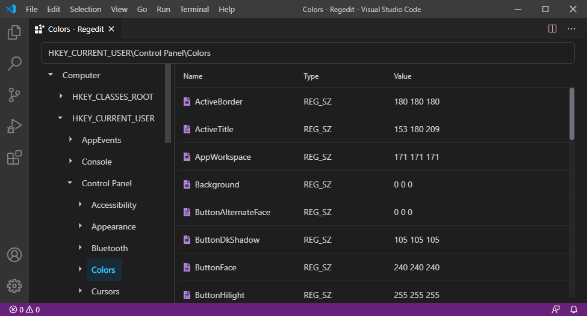
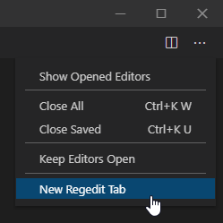

# Regedit - A registry editor inside VS Code

The extension allows to access and modify the Windows registry from within Visual Studio Code.

To open the extension, use the "New Regedit Tab" command or open a new tab from the Editor Actions menu.

To rename or modify values, click on their name or value.

To remove a key or a value, use the middle mouse button.

To refresh the data, click on the address bar and press Enter.

This extension doesn't allow to rename keys.

## More information

I created this extension to learn how to develop extensions for VS Code. This extension demonstrates how to use React inside a WebView, how to communicate with the extension process, and how to implement localization.

Main dependencies:
* React as the UI framework.
* [React Suite](https://rsuitejs.com/) for the main UI components.
* [native-reg](https://github.com/simonbuchan/native-reg) for accessing the registry from the extension process.

The React UI source code can be found here: [vscode-regedit-ui](https://github.com/m417z/vscode-regedit-ui).

Icon by [Freepik](https://www.freepik.com/).

## Features that can be added in the future

Below is a list of features that can be added. Note that it doesn't mean that I plan to add them.

### Features available in the Windows regedit

* Support for more types.
* Binary data access for all types.
* Key renaming (requires using [the undocumented `RegRenameKey` API](https://stackoverflow.com/a/43854340)).
* Search.
* Permissions.
* Import and export.
* Hive loading and unloading.
* Network registry.
* Favorites.
* Print?! (Why does Microsoft have this feature?)

### More features

* Undo and redo.
* Moving values and child keys between keys.
* Clipboard operations.
* Displaying last modified time.
